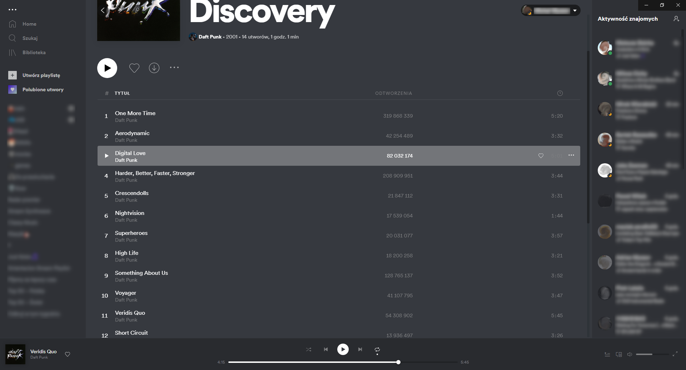
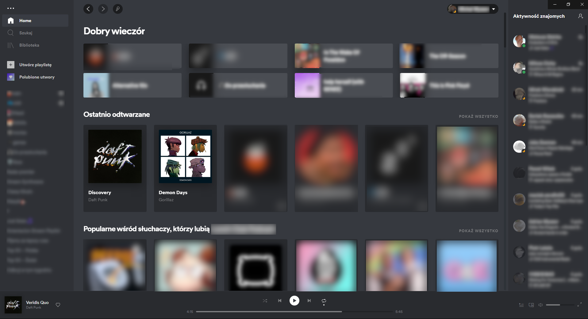
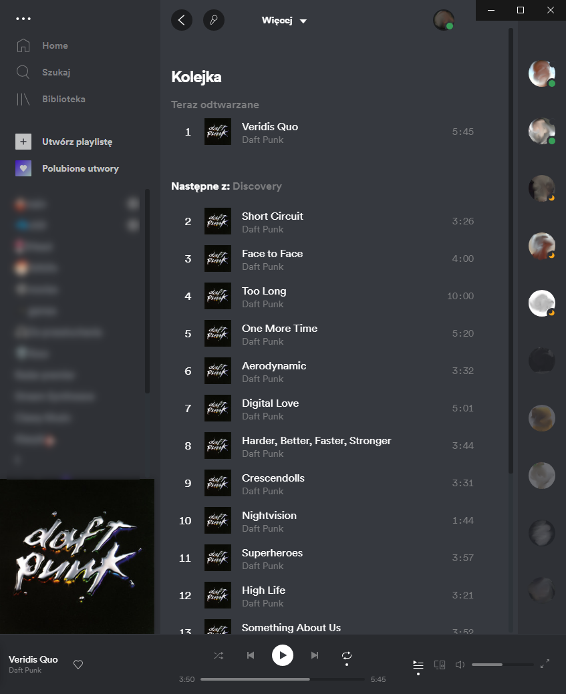

# Discord

## Screenshots

## More

If you want discord-like stauts indicators [install the `discordStatus.js` extension](https://github.com/khanhas/spicetify-cli/wiki/Extensions).

Inspired by [Discord](https://discord.com/) and [this Reddit post](https://www.reddit.com/r/discordapp/comments/l68xjn/if_spotify_were_owned_by_discord/)
